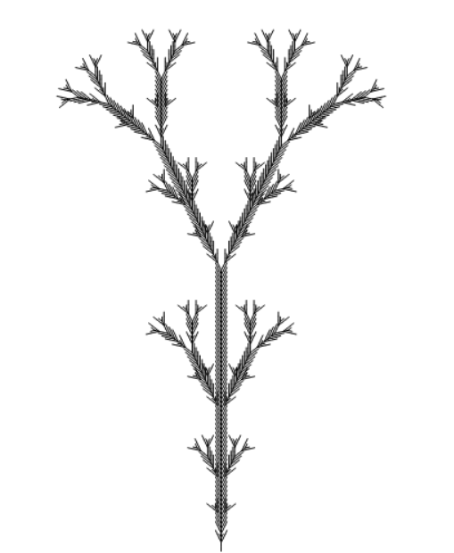
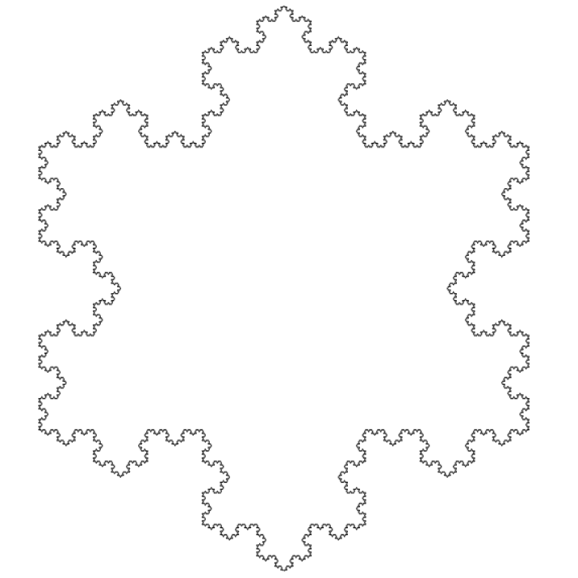
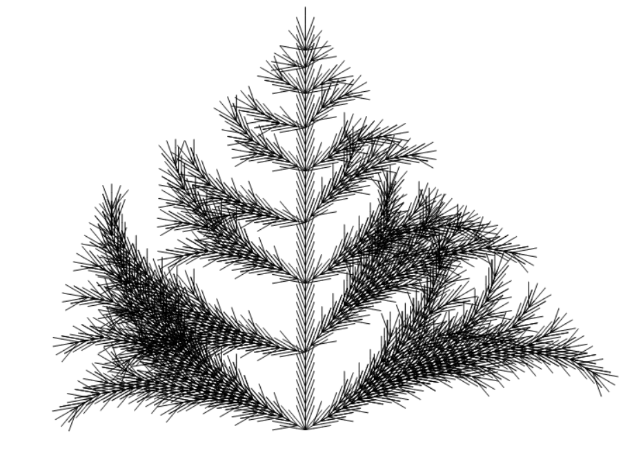
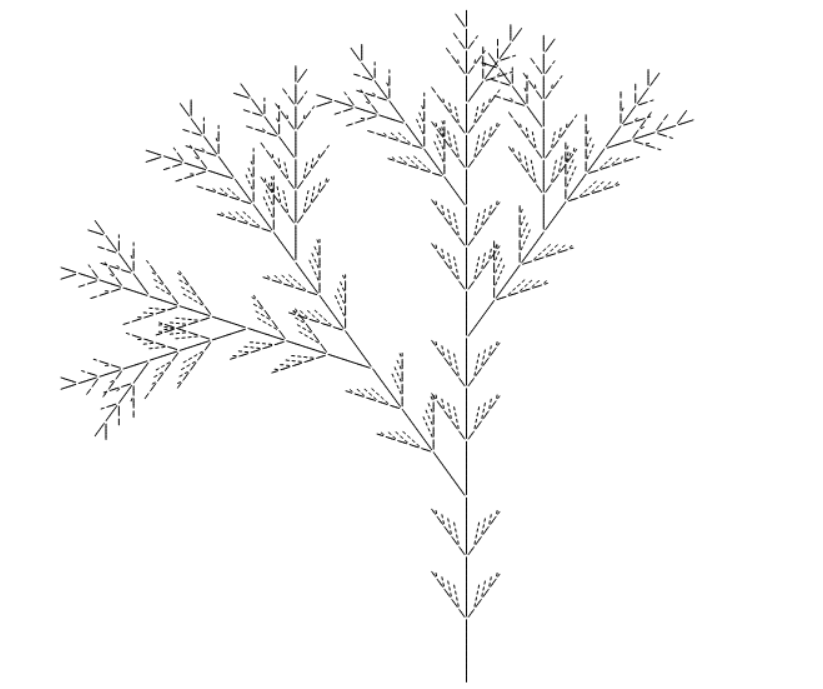

# L-System
## Bush

  ```C++
// Bush creation
LSystem lsys;
lsys.setAxiom("Y");
lsys.addRule('X', "X[-FFF][+FFF]FX");
lsys.addRule('Y', "YFX[+Y][-Y]");
lsys.recurse(6);
lsys.dumpRecursion();
lsys.setLength(4.0f);
lsys.setAngle((float)DEGTORAD(25.7));
```

<td></td>

## Koch

```C++
lsys.setAxiom("F++F++F");
lsys.addRule('F', "F-F++F-F");
lsys.addRule('Y', "YFX[+Y][-Y]");
lsys.recurse(5);
lsys.dumpRecursion();
lsys.setLength(2.0f);
lsys.setAngle((float)DEGTORAD(60));
```

<td></td>


## Saupe

```C++
lsys.setAxiom("VZFFF");
lsys.addRule('V', "[+++W][---W]YV");
lsys.addRule('W', "+X[-W]Z");
lsys.addRule('X', "-W[+X]Z");
lsys.addRule('Y', "YZ");
lsys.addRule('Z', " [-FFF][+FFF]F");
lsys.recurse(11);
lsys.dumpRecursion();
lsys.setLength(10.0f);
lsys.setAngle((float)DEGTORAD(20));
```

<td></td>


## Algae
```C++
lsys.setAxiom("af");
lsys.addRule('a', "FFFFFv[+++h][---q]fb");
lsys.addRule('b', "FFFFFv[+++h][---q]fc");
lsys.addRule('c', "FFFFFv[+++fa]fd");
lsys.addRule('d', "FFFFFv[+++h][---q]fe");
lsys.addRule('e', "FFFFFv[+++h][---q]fg");
lsys.addRule('g', "FFFFFv[---fa]fa");
lsys.addRule('h', "ifFF");
lsys.addRule('i', "fFFF[--m]j");
lsys.addRule('j', "fFFF[--n]k");
lsys.addRule('k', "fFFF[--o]l");
lsys.addRule('l', "fFFF[--p]");
lsys.addRule('m', "fFn");
lsys.addRule('n', "fFo");
lsys.addRule('o', "fFp");
lsys.addRule('p', "fF");
lsys.addRule('q', "rfF");
lsys.addRule('r', "fFFF[++m]s");
lsys.addRule('s', "fFFF[++n]t");
lsys.addRule('t', "fFFF[++o]u");
lsys.addRule('u', "fFFF[++p]");
lsys.addRule('v', "Fv");	
lsys.recurse(16);
lsys.dumpRecursion();
lsys.setLength(2.5f);
lsys.setAngle((float)DEGTORAD(12));
```

<td></td>
